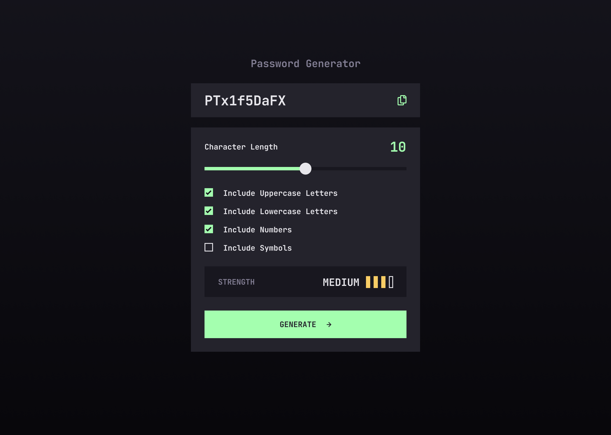
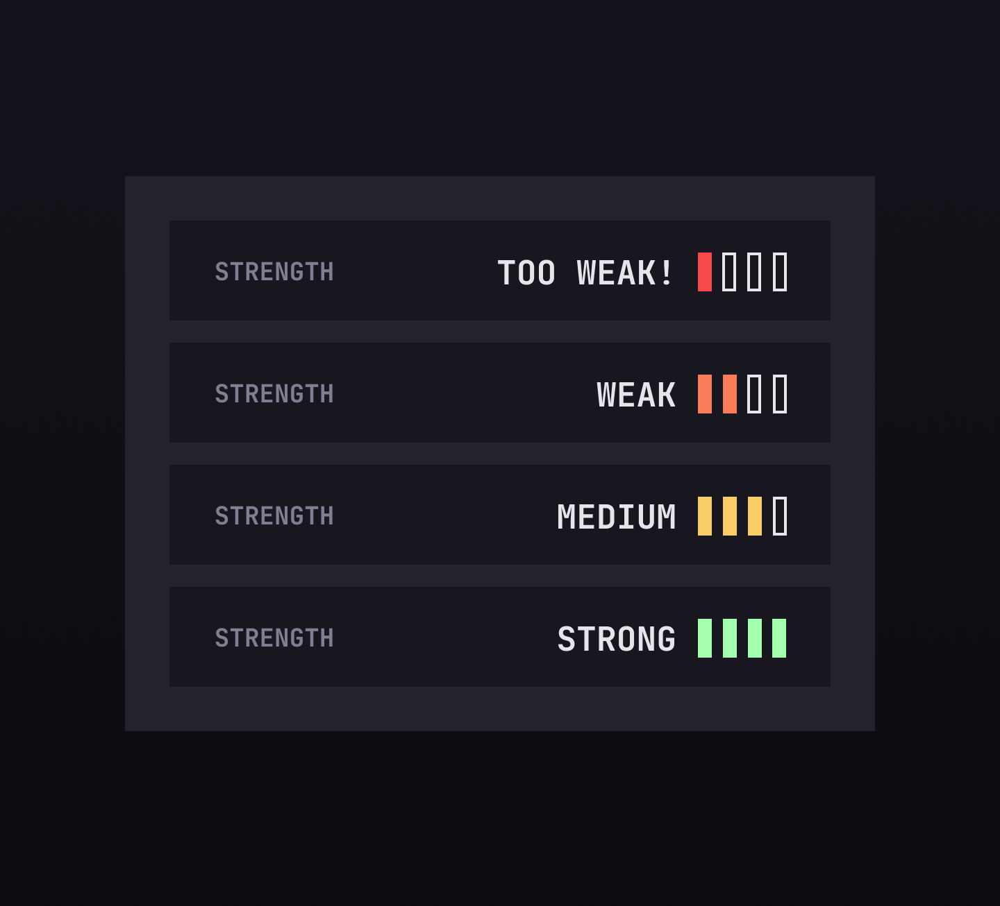
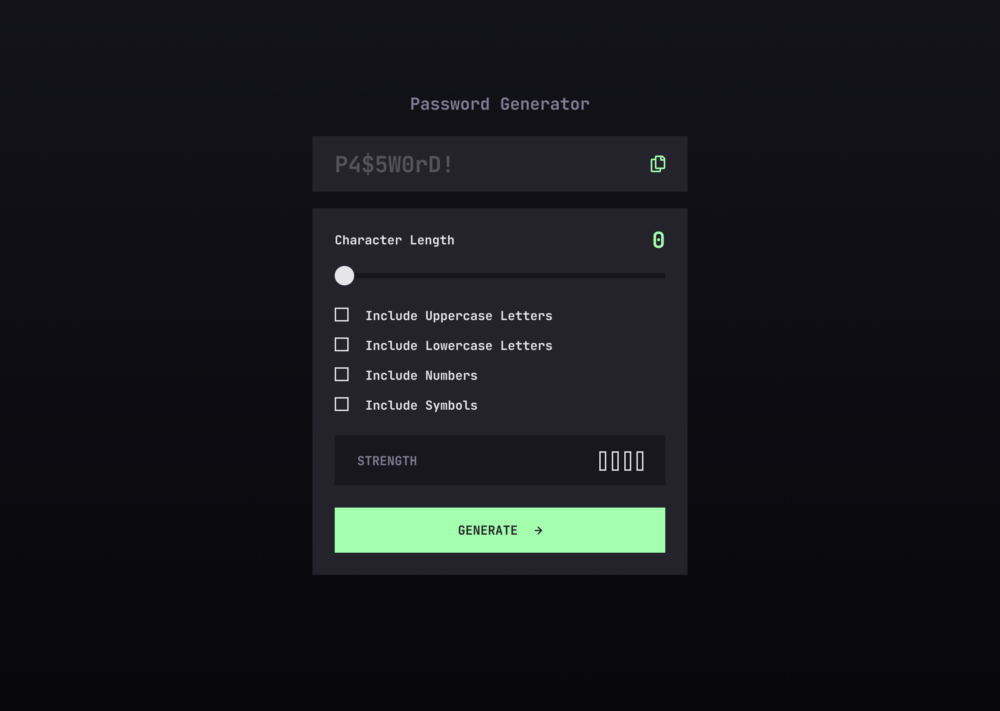
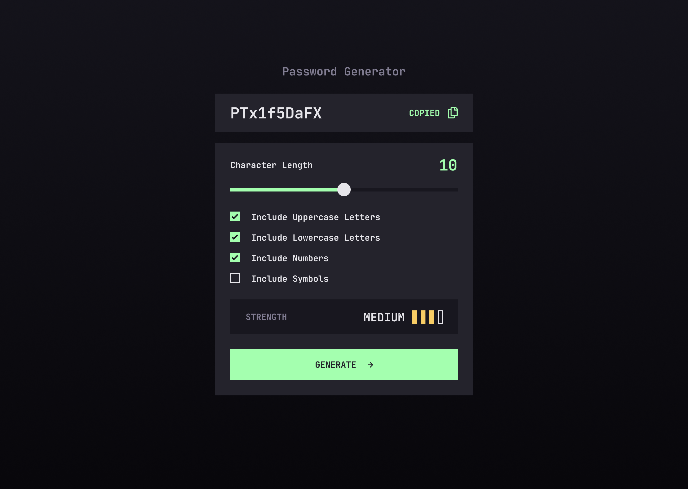

# RandPassGen

RandPassGen is a user-friendly password generator application that uses modern web technologies for secure password creation with customizable settings.



## Project Overview

### Purpose

The purpose of RandPassGen is to generate random, secure passwords based on user-defined criteria, such as length and character types. Users can customize the password settings and copy the generated password for use in various applications.

### Tech Stack

#### Frontend

- **Next.js 14**: A React JS framework for server-rendered applications and static websites.
- **Radix UI**: Used for UI components to ensure accessibility and high-quality user interfaces.
- **Tailwind CSS**: Applied for styling, providing a utility-first approach to design.
- **Zustand**: Used for state management, with slices for modular and maintainable state handling.
- **React Hook Form**: Applied for form handling and validation.
- **Zod**: Schema declaration and validation library for TypeScript.

### Additional Packages

- **Class Variance Authority**: Used for handling variant-based styling.
- **Framer Motion**: Utilized for animations and enhancing user experience.
- **Lucide React**: Included for icon components.
- **Sonner**: Used for toast notifications.

## Key Features

- **Password Generation**: Generate random, secure passwords with customizable length and character types.
- **Password Strength Indicator**: Visual indication of the generated password strength.
- **Copy to Clipboard**: Easily copy the generated password to the clipboard.
- **Form Validation**: Ensures valid input using Zod and React Hook Form.
- **Dynamic Theming**: Implemented using Tailwind CSS variables.

## Getting Started

1. **Install dependencies**:

   ```sh
   npm install
   ```

2. **Run the development server**:

   ```sh
    npm run dev
   ```

3. Build for Production & Start

   ```sh
   npm run build
   npm run start
   ```

## Usage

### Generate a Password

1. **Set Character Length**: Use the slider to set the desired password length.
2. **Select Character Types**: Check the boxes to include uppercase letters, lowercase letters, numbers, and symbols.
3. **Generate Password**: Click the "Generate" button to create a password.
4. **Copy Password**: Click the copy icon to copy the generated password to the clipboard.

### Password Strength

The strength of the generated password is visually indicated with color-coded pills:

- **Too Weak**: Red
- **Weak**: Orange
- **Medium**: Yellow
- **Strong**: Green



## Screenshots





